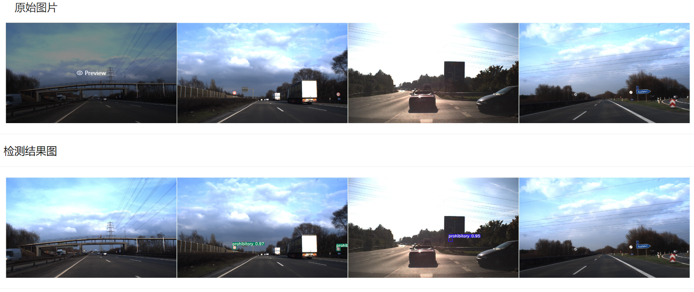

# 交通标志检测系统

## 后端

1. 技术栈： Flask + Mysql

## 前端

1. 技术栈：React

- 开发环境：VScode

## 开发过程

1. 5.8 完成登录页面验证码功能
2. 5.10 完善登录页面与用户页面
3. 5.11 完成用户列表的增删改查
4. 5.12 完善页面功能，开始处理detection
5. 5.15 处理接受图片
6. 5.17 实现图片检测功能
7. 
